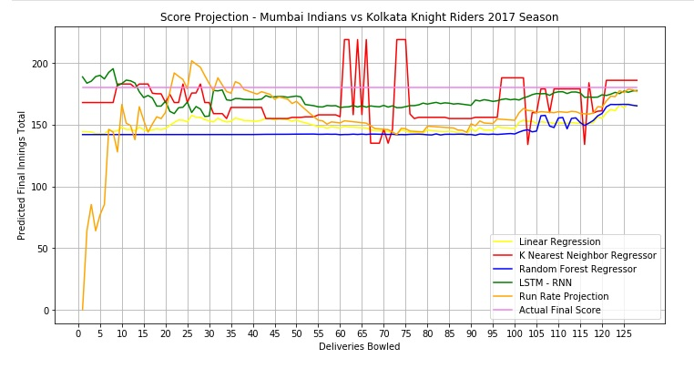

# IPL PREDICTION

The project aims at creating  Machine Learning models to predict the final score of an inning in a Indian Premier League T20 cricket match.

# Setting up the environment
#### Python Notebook
You can install **Anaconda** on your system as it is packaged with multiple tools like Jupyter Notebook, Jupyter Lab, Spyder, etc. It also setups essential libraries and create pyhton environment to execute programs. Alternatively, you can install just Jupyter Notebook or Jupyter Lab on your system and execute the program.   

#### Libraries
+ Pandas
+ Numpy
+ Matplotlib
+ Pylab
+ Sklearn train_test_split
+ Sklearn RandomForestRegressor
+ Sklearn cross_val_score
+ Sklearn accuracy_score
+ Sklearn r2_score
+ Sklearn mean_squared_error
+ Keras Sequential
+ Keras Dense
+ Keras LSTM
+ Keras Flatten
+ Keras Dropout
+ Keras SimpleRNN

# Dataset
The dataset has been obtained from the repository [Indian Premier League (Cricket)](https://www.kaggle.com/manasgarg/ipl) hosted
on Kaggle. The dataset comprised of two csv files
“matches.csv” and “deliveries.csv”. The characteristics of the individual files are as below:

#### Matches.csv
This data file comprises of records of all matches played in IPL from season 2008 to 2017. The data file comprises of 18 features. It contains data corresponding to the name of the teams, venue of the match, outcome, umpires and details pertaining to the matches played. There are 636 entries in the data file.

#### Deliveries.csv
This data file comprises of records of every delivery bowled in each of the matches. The records are chronologically arranged. The data includes 23 features including the outcome of every delivery and the number of runs scores and the way runs were scored. There are 150460 entries in the data file.

# Models
+ Linear Regressor
+ k Nearest Neighbors Regressor
+ Random Forest Regressors
+ Recurrent Neural Networks using LSTM

# Performance Comparison
After evaluating the performance of different models on train, test and evaluation data we infer that RNNs with LSTM is the best model for the given problem.

